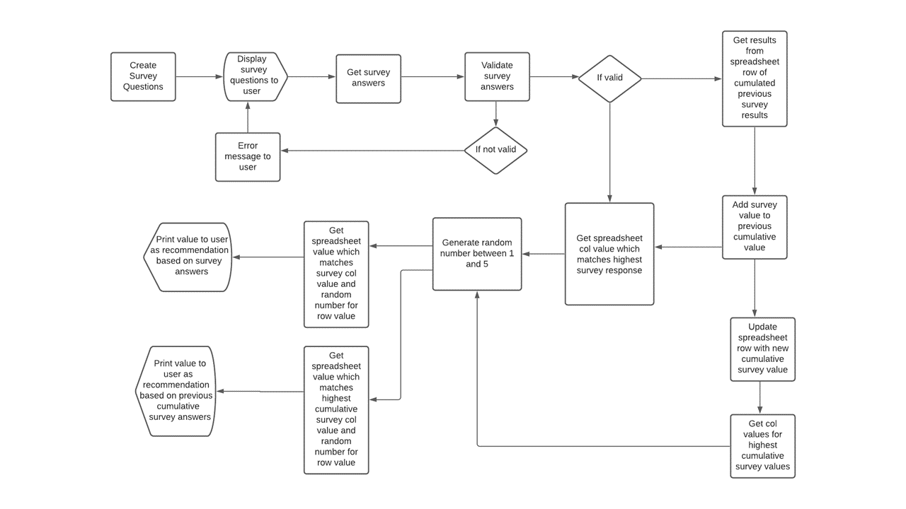

# Progressive Rock mp3 Club
## Portfolio-project-2-Python Essentials

### Overview
the Progressive Rock mp3 club is an imagined online resource where users upon joining will be able to download progressive rock music. This particular app focusses upon the registration of the user. As part of the registration the user is asked a series of four survey questions. From the responses to each of the four questions a recommendation is made for an album the user may like. On answering all of the four questions an album of the week is recommended to the user.

### How it works
The four questions are broken down into categories relating to different time periods or genres of progressive rock music. The questions in each category provide the user with 6 choices of band and asks the user to rate the six bands in order of preference. Upon completion of each category, a (randomly generated) recommendation is made for an album the user may like by their favourite band in the category. When all four category questions are answered the user is given an album of the week recomendation. The album of the week is generated through a process as follows. At the start of the program, random results are generated for each band and loaded into the worksheets. The random results simulate the numbers of mp3 downloads for each band in the previous week. The users survey answers are added to the random scores and an album is selected randomly from the band with the highest score as the album of the week recommendation.

### Data Model
Data is stored in four google worksheets. Each worksheet represents the four categories (genres or periods of progressive rock) for which survey questions are asked The categories are "Proto-Prog, Classic Prog, Neo-Prog and Contemporary Prog.
Each of the four worksheets has six columns representing bands which fall within the category (N.B: The inclusion of Pink Floyd within two categories is deliberate). Below the heading row for each column there are five rows for albums by each band. Below the five album row for each band, data from a simulated randomly generated previous survey or sales data is stored. Upon the user responding validly to survey questions, the results are added to the previous simulated results and added as a new row. A further new row is added each time the program is run.

### Data Process

figure 1 below shows the steps from survey questions to results and are detailed below in features.

figure1: Progressive Rock mp3 Club flowchart

[flow chart link](https://lucid.app/lucidchart/745dce97-b375-477a-8206-305d663e8823/edit?beaconFlowId=CB530221E3E599B0&invitationId=inv_99fdfcce-3d1c-4598-b6cc-7f0c1f72693f&page=0_0#)

### Features

1. Welcome message displayed to user and survey initialised
    - starting worksheet values generated
        *function: generate_starting_worksheet_values*
    - generated data is appended to relevant worksheet
        *function: initiate_worksheet*
2. User prompted to enter first name
    - user is asked to enter first name, user input is validated
    - if valid user is asked to complete survey.
        *function: get_name*
3. Instructions and first survey question displayed to user.
    - instructions are displayed to user
        *function: print_instructions*
    - user is asked first question to rate bands in order of preference from one to six. 
    -   The list of bands are displayed to the user, so the user knows the options that will be available. 
    -   Options are then displayed to user one at a time. 
    -   Upon valid completion of option next option is displayed to user for a one to six rating.
        *function: survey_question*
        *function: get_question_input*
        *function: check_input_range_and_integer*
4. Validate for duplicates
    - when the user has input values for all six options, the options are checked for duplicate values. 
    - If data valid it is added to results on last row of relevant category worksheet and apended as new row.
        *function: check_if_duplicates*
        *function: calc_total_survey*
        *function: update_worksheet*
5. Display recomendations
    -   An album recommendation is displayed to user by the band the user has rated as their favourite in each category. The band name and a link to the album page on the prog archives web-site is also given. 
    - N.B: the prog archive website link works on Gitpod/VSCode but does not work on the Heroku Code Institute terminal. I have chosen to still display the link because it can be copied and pasted into a browser so still has value.
    - Next question in series of four is displayed to user.
        *function: get_user_input_recommendations*
        *fuction: print_recommendations*
6. Display Overall (Offer of the week) recommendation
    - Upon the valid completion of the final question the recommendations for the four category questions are again displayed as a recap. 
    - A recommendation is made for the album of the week. This is a random album selection from the band that had the highest value when initial survey scores and user input scores are added together.
        *function: get_band_names*
        *function: get_accumulated_survey_data*
        *function: compile_all_bands_list*
        *function: calculate_survey_data*
        *function: get_band_of_week*
        *function: get_album_of_week_band_index*
        *function: get_album_of_week*

### validation features
1. first name

Potential future modifications

Testing

Bugs

Validator testing

Deployment

Credits

