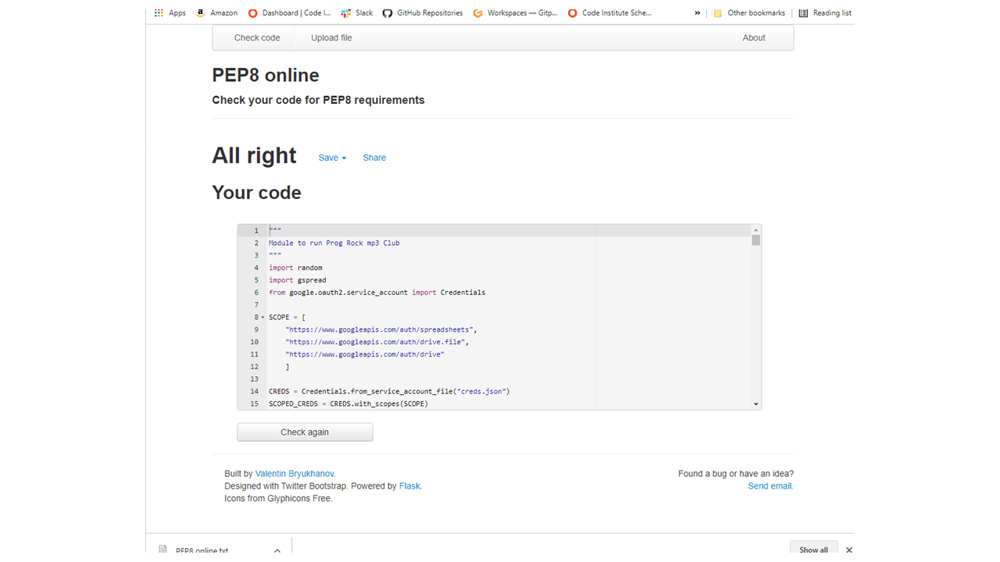

# Progressive Rock mp3 Club
## Portfolio-project-2-Python Essentials

### Overview

the **Progressive Rock mp3 club** is an imagined online resource where users upon joining will be able to download progressive rock music. This particular app focusses upon the registration of the user. As part of the registration the user is asked a series of four survey questions. From the responses to each of the four questions a recommendation is made for an album the user may like. On answering all of the four questions an album of the week is recommended to the user.

### How it works

The four questions are broken down into categories relating to different time periods or genres of progressive rock music. The questions in each category provide the user with 6 choices of band and asks the user to rate the six bands in order of preference. Upon completion of each category, a (randomly generated) recommendation is made for an album the user may like by their favourite band in the category. When all four category questions are answered the user is given an album of the week recomendation. The album of the week is generated through a process as follows. At the start of the program, random results are generated for each band and loaded into the worksheets. The random results simulate the numbers of mp3 downloads for each band in the previous week. The users survey answers are added to the random scores and an album is selected randomly from the band with the highest score as the album of the week recommendation.

### Data Model

Data is stored in four google worksheets. Each worksheet represents the four categories (genres or periods of progressive rock) for which survey questions are asked The categories are "Proto-Prog, Classic Prog, Neo-Prog and Contemporary Prog.
Each of the four worksheets has six columns representing bands which fall within the category (N.B: The inclusion of Pink Floyd within two categories is deliberate). Below the heading row for each column there are five rows for albums by each band. Below the five album rows for each band, data from a simulated randomly generated previous survey or sales data is stored. Upon the user responding validly to survey questions, the results are added to the previous simulated results and added as a new row. A further new row is added each time the program is run.

### Data Process

figure 1 below shows the steps from survey questions to results and are detailed below in features.

figure1: Progressive Rock mp3 Club flowchart

[flow chart link](https://lucid.app/lucidchart/745dce97-b375-477a-8206-305d663e8823/edit?invitationId=inv_99fdfcce-3d1c-4598-b6cc-7f0c1f72693f)
*N.B: Chart page has been set to share with anyone has has this link*

### Features

1. Welcome message displayed to the user and survey initialised
    - starting worksheet values generated
       - *function: generate_starting_worksheet_values*
    - generated data is appended to relevant worksheet
        - *function: initiate_worksheet*
2. User prompted to enter first name
    - user is asked to enter first name, user input is validated
    - if valid, the user is asked to complete the survey.
        - *function: get_name*
3. Instructions and the first survey question are displayed to the user.
    - instructions are displayed to the user
        - *function: print_instructions*
    - The user is asked the first question to rate bands in order of preference from one to six. 
    -   The list of bands are displayed to the user, so the user knows the options that will be available. 
    -   Options are then displayed to the user one at a time. 
    -   Upon valid completion of an option, the next option is displayed to the user for a one to six rating.
        - *function: survey_question*
        - *function: get_question_input*
        - *function: check_input_range_and_integer*
4. Validate for duplicates
    - when the user has input values for all six options, the options are checked for duplicate values. 
    - If data is valid it is added to results on last row of relevant category worksheet and apended as a new row.
        - *function: check_if_duplicates*
        - *function: calc_total_survey*
        - *function: update_worksheet*
5. Display recomendations
    -   An album recommendation is displayed to the user by the band the user has rated as their favourite in each category. The band name and a link to the album page on the prog archives web-site is also given. 
    - N.B: the prog archive website link works on Gitpod/VSCode but does not work on the Heroku Code Institute terminal. I have chosen to still display the link because it can be copied and pasted into a browser so still has value.
    - Next question in series of four is displayed to user.
        - *function: get_user_input_recommendations*
        - *function: print_recommendations*
6. Display Overall (Offer of the week) recommendation
    - Upon the valid completion of the final question the recommendations for the four category questions are again displayed as a recap. 
    - A recommendation is made for the album of the week. This is a random album selection from the band that had the highest value when initial survey scores and user input scores are added together.
        - *function: get_band_names*
        - *function: get_accumulated_survey_data*
        - *function: compile_all_bands_list*
        - *function: calculate_survey_data*
        - *function: get_band_of_week*
        - *function: get_album_of_week_band_index*
        - *function: get_album_of_week*
    7. The main function determines the sequence of displaying messages to the user and calling functions to process data.
        - *function: main*

#### validation features
1. first name: the first name input is checked for being three characters or more
2. The question options responses are validated on input for:
    - must not be blank,
    - must be integer in range 1 to 6,
3. Upon completion of a question (all six options) the question values are checked to ensure there are no duplicated values.

### Potential future modifications

- In development Colored (https://pypi.org/project/colored/) was used to provide colouring and text formatting to the output to terminal. Testing revealed this was not supported by the Code Institute terminal so was removed from the final project submission. These improvements could be implemented in a better coding environment.
- Similarly hyperlinks seem not to work within the Code Institute terminal. Testing shows they are fully functional in other coding environments.
- Clearly it would be best practice for data to be stored in a database rather than Google sheets. There would be plenty of scope for a much wider set of data to be used in a more appropriate back-end environment.
- With less restrictions imposed by the front and back end environments there would be options to provide, images, link and mp3 playbacks amongst the outputs to the user. 

### Testing

Testing was conducted extensively by inputing sample responses into both the Gitpod VScode editor terminal and the Code Insitute Heroku terminal. Specifically:
1. Testing the following invalid data inputs for first name produces correct program response:
- less than three characters
- blank input
- Non-alphabetical characters were not tested since this would not have any impact on the running of the program.
2. Testing that invalid inputs for question options produces correct program response:
-   blank input
-   entering zero
-   entering numerals with decimal points
-   entering values outside of range 1 to 6
-   entering non numerical characters
3. Testing that duplicate option values within questions produces the correct response:
- Entering duplicate values for options.
4. Testing that the program proceeded as expected upon entering valid inputs after entering invalid inputs (see bugs below).
5. Testing a range of various valid inputs to check correct data is returned for corresponding inputs.

#### Validator testing
The run.py code was copied into the PEP8 online Python code validator and no issues were reported (see figure 2 below)

screenshot of PEP8 online Python code validator results for run.py

There are no problems reported in the Gitpod VS code editor

### Bugs

There are no outstanding known bugs.

1. A bug was discovered in testing in the following circumstances:
- entering a duplicate value for an option within a question and receiving an error.
- Subsequently entering valid values
Outcome: An error message occured reporting duplicate values could not be entered.
Cause: The blank list to which data was appended was declared outside of the while loop. Therfore as the loop continued after a data error the list was not being reset to blank. Duplicate values were found in validation because they duplicated non-cleared values.
Solution: Declare the blank list for appending data inside and at start of while loop.

### Other issues

After successful setting up and testing of the Heroku Code Institute terminal App and before deployment of the project something appeared to break. Upon opening and running the program in the terminal, the terminal just printed out the data in the worksheets and would not otherwise function. Rather than solving this problem I set up a new platform which now functions as expected. The original problem is not known for certain, but I have been advised by my Mentor that sometimes if the App is left on automatic deployment some commits to GitHub can trip it up.

I put in a lot of work to clear some 100+ error messages/warnings in VS Code for line length over 80 characters. This included abbreviating variable names, wrappings lists over a number of lines etc.

### Deployment

The project can be viewed at Github repository:
[link to github repository for project](https://github.com/marbri-18/Progressive-rock-mp3-club)

This project was deployed using Code Institute's terminal a on a Heroku platform template.
[link to Heroku platform](https://dashboard.heroku.com/apps/prog-rock-mp3-club)

#### Steps for deployment
- Create a new Heroku app
- set the buildbacks to Python and NodeJS in that order
- Link the Heroku App to the corresponding GitHub repository
- click Deploy
- Set deployment to automatic deployment.
*from Code Institute Deployment Paragraph - sample README - Ultimate Battleships*

### Credits

- Code Institute for Python Essentials module and Heroku terminal app.
- My mentor Sammy Dartnall for overall guidance, encouragement and support and in particular for advice on passing in a list as an argument to a function. This set me a challenge that proved immensely frustrating in its solving but very satisfying and fulfilling in its outcome. It also seems to me to be a very valuable learning outcome.
- I found helpful advice on Stack Overflow for checking of duplicate values in a list, slicing strings on characters and wrapping lists over multiple lines.
- I used Colored (https://pypi.org/project/colored/) for formatting and colouring of text output in development but this was not carried through to the final version.
- I used Lucid (https://lucid.app/) to produce my project flowchart.

